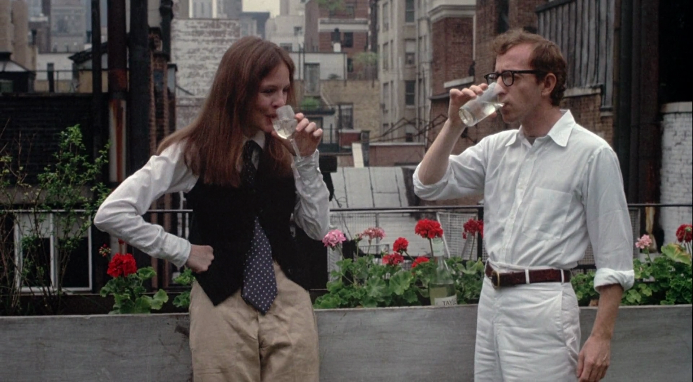
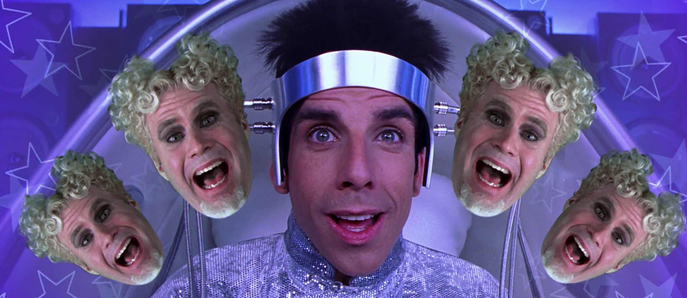
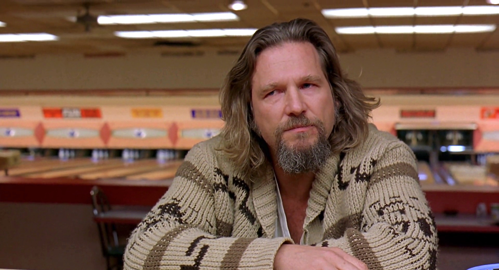

هذه قائمة محدثة تحتوي الأفلام التي ساعدتني على تبديل التعاسة بإبتسامة.
<!-- end -->

###(3)
فليم: **Annie hall** 
سنة: **1977** 
إخراج: **Woody Allen** 
قصة: **Woody Allen** 

وودي آلن في أكتر أعماله شهرة وأكترهم تداولًا في المينستريم، بيبتدي الفيلم بمونولوج عن نكتة ما وبيكمل من غير بناء درامي في حكي لقطات جوا لقطات. الفيلم حزين لكنه مضحك ومسلي ومفيد لو متبهدل في علاقاتك العاطفية.

###(2)
فليم: **Zoolander** 
سنة: **2001** 
إخراج: **Ben Stiller** 
قصة: **Drake Sather, Ben Stiller** 

دا فيلم كوميدي بارودي. زولاندر عارض الأزياء بيتم غسل مخه علشان يقتل زعيم ماليزيا، ومن خلال الحبكة دي شخصية زولاندر بتحاول تجاوب على بعض الأسئلة الوجودية بأسلوب سطحي جدًا.

###(1)
فليم: **The Big Lebowski** 
سنة: **1998** 
إخراج: **Coen Brothers** 
قصة: **Coen Brothers** 

في بداية التلت الأول من الفيلم كنت بأفأف من الملل لكن مع نهايته وبداية  التلت التاني والتالت سخسخت من الضحك، الفيلم مش واخد تيمة معينة يعني هو لا فيلم عن البولينج ولا عن الخطف، يمكن حسيته أكتر عن الصحبة الحلوة، على أي حال أنا في الآخر ضحكت فشخ.
