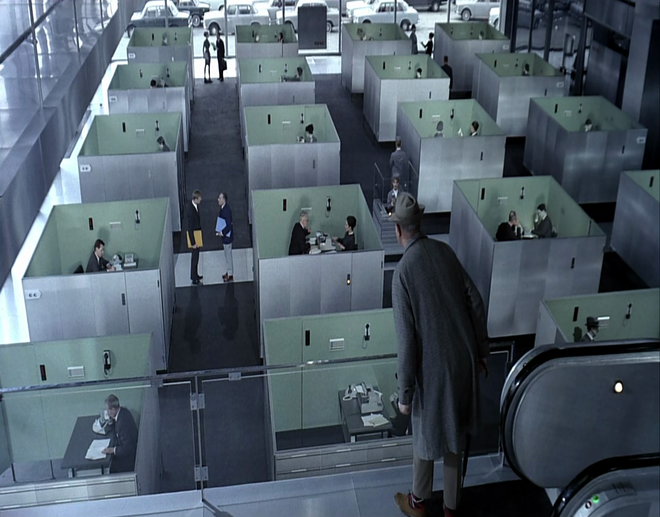

هذه قائمة محدثة تحتوي الأفلام المكونة من لقطات تعتبر كل لقطة لوحة فنية منفصلة تستهدف الوصول لقلب المشاهد عن طريق المتعة البصرية لا الحسية.
<!-- end -->

###(1)
فليم: **Playtime** 
سنة: **1967**  
إخراج: **Jacques Tati** 
قصة: **Jacques Tati, Jacques Lagrange** 

 
الفيلم الكوميدي بلاي تايم لجاك تاتي، تاتي بذل كل ما يملك من فلوس ومجهود علشان الفيلم يطلع للنور، الشغل في الفيلم استمر لسنتين، وتاتي كان دائمًا يقول إن دا مشروعي الأهم والأخير.
المشاهد متناسقة مع بعضها جدا، كمان حركة الممثلين محسوبة بالمليمتر.

لما كنت باتفرج كنت حاسس بكوميديا صامتة في مواقف كتير، كمان كانت بترن في ودني جملة نجيب محفوظ "لا تغالِ في المثالية وإلا مت تقززًا".
