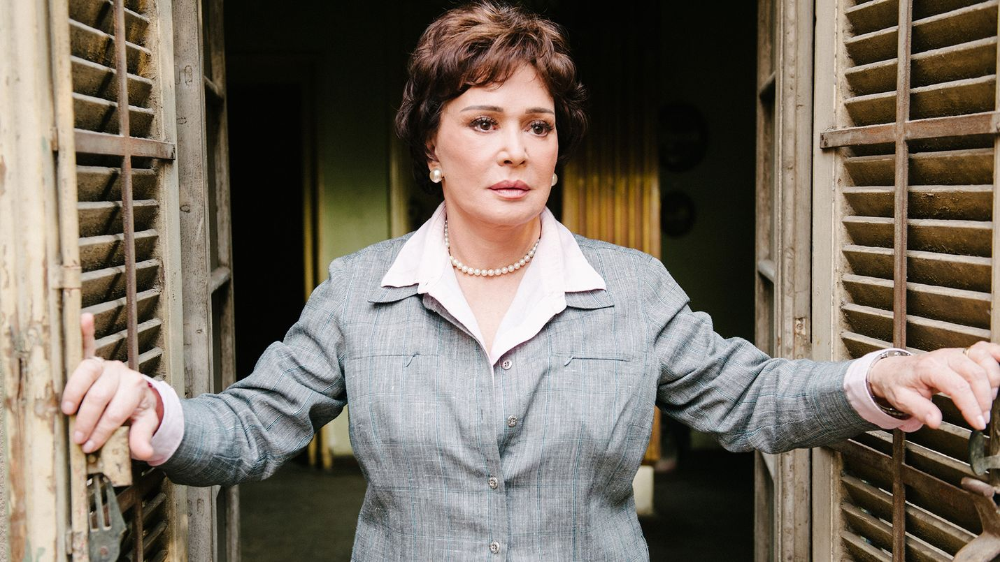
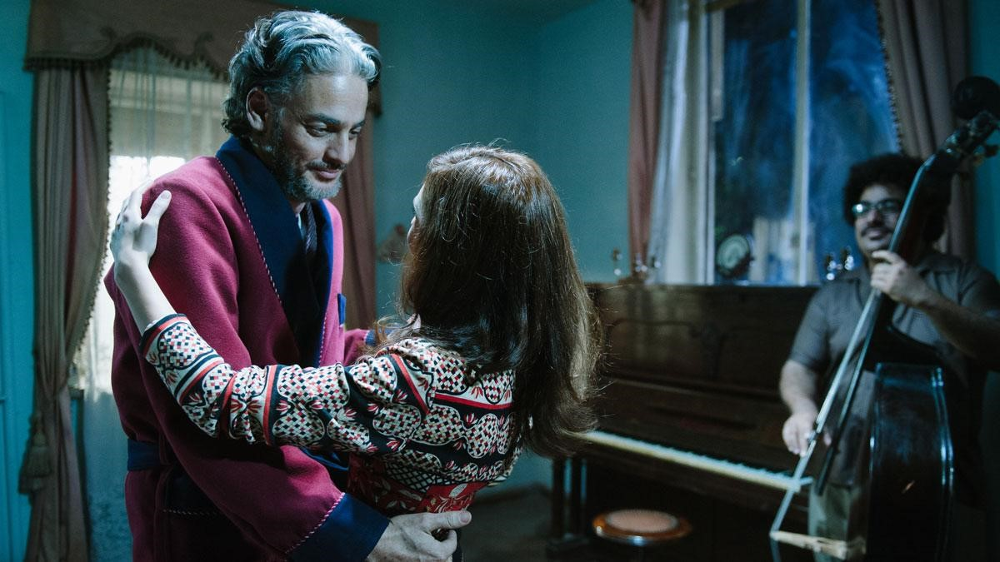
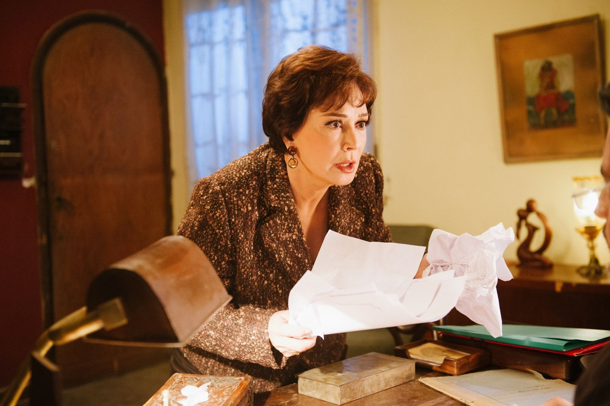
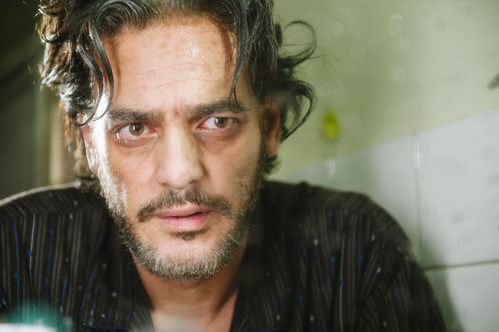

# الصُدفة
الفيلم دا لقيته مرمي عالفيسبوك في 2015 تقريبًا كانت المخرجة رافعاه على قناتها عاليوتيوب.
في رأيي كانت أجمل صدفة في السنة دي، بعد ما عبدالغني إشتغل في الشركة اللي أنا شغال فيها وعرفنا بعض.

## الجماليات
__آيتن أمين__ مخرجة الفيلم اللي يعتبر أول أفلامها الدرامية الطويلة فرضت نفسها بأسلوبها الواقعي الأقرب لخان عن خيري بشارة.
الفيلم بلا هدف لكنه جميل، إستخدام الكُتاب __محمود عزت__ و__محمد الحاج__ للشعر والمزيكا كان أبدع ما يكون.
الإستعانة بشعر أمل دنقل وإلقاء البطل خالد أبوالنجا لجزء من قصيدة **الجنوبي** كانت اللقطة اللي بتعلى فيها شاعرية الفيلم علشان توصل لأعلى نقطة:

ليت أسماء تعرف أن أباها صعد
لم يمت
هل يموت الذي كان يحيا
كأن الحياة أبد
وكأن الشراب نفد
وكأن البنات الجميلات يمشين فوق الزبد
عاش منتصباً، بينما
ينحني القلب يبحث عما فقد.
ليت "أسماء"
تعرف أن أباها الذي
حفظ الحب والأصدقاء تصاويره
وهو يضحك
وهو يفكر
وهو يفتش عما يقيم الأود .
ليت "أسماء" تعرف أن البنات الجميلات
خبأنه بين أوراقهن
وعلمنه أن يسير
ولا يلتقي بأحد.

## هناء

**هبة يسري** المخرجة الشابة العامود الأساسي في العمل الدرامي البديع **سابع جار** اللي بتخرجة بالإشتراك مع آيتن أمين ونادين خان.

بتجسد شخصية بنت غلبانة بتشتغل في صيدلية وبتعدي على **حسين** تديه الحقن العلاجية اللي محتاجها، بتتكون ما بينهم علاقة ود وبيحس حسين بالإمتنان لوجود هناء في حياته.

## حيدر
الشاب اللي متشحطط ورا حسين علشان يكون حلقة وصل ما بينه في الفيلا ومابين المكتب وحسين بيعامله بمنتهى الخشونة لكنه في أعماقه في غاية الإمتنان لحيدر ولمجهوده

## حسين
الراجل العجوز المصاب بمرض بيقربه من الموت أكثر، بيقرر الإنطواء في فيلاته، إلى أن تأتي أخته وحفيدها للمكوث معه، في البداية يقبل مرغمًا هذا الوضع الجديد المفروض عليه.

حسين لديه تجارب كثيرة يعيش على ذكراها، مع مجيء سيف يستشعر حسين لذة نقل خبراته إلى حفيده وأصدقائه، في إحدى اللقطات يقدم له حتة حشيش نضيفة، في أخرى يعزف لهم مقطوعة "على بلد المحبوب" عالعود.

أحببت حسين وأحببت الفيلم لأنه وعلى الرغم من فارق السن إلا أن الحالة التى يعيشها حسين، أعيشها أنا أيضًا، فأنا في بعض ألأحيان أشعر أن تجاربي أكثر من الآخرين وأن عليهم المرور بنفس التجارب قبل إبداء رأيهم.

