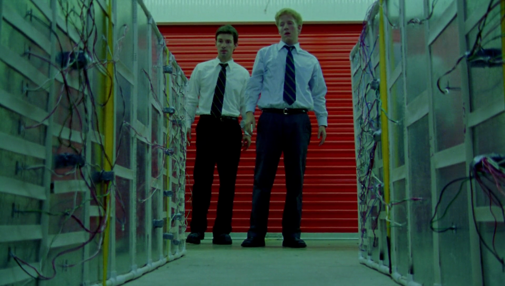

هذه قائمة محدثة تحتوي أفلام الخيال العلمي التي سببت لي حالة من الأرتباك وأجبرتني على التفكير والتركيز مع/في كل مشهد.
<!-- end -->

###(1)
فليم: **Primer** 
سنة: **2004** 
إخراج: **Shane Carruth** 
قصة: **Shane Carruth** 

في أسباب كتير خلتني أتعلق ببريمير أهمها إن اللي كان وراه وعمل كل حاجة فيه حرفيًا بالدقة دي كان مهندس برمجة والفيلم دا هو المشروع اللي بيشبع فيه شغفه بفكرة السينما والهندسة، كمان الفيلم تكلفة إنتاجه الـ 7000 دولار زهيدة جدًا لكن الناتج النهائي كان متماسك ورصين زي ما بنشوف في الفيلم. 
الفيلم بيتناول فكرة السفر بالزمن بشكل مغاير لكل أفلام السفر بالزمن الإعتيادية، أعتقد دا فيلم المخرج عمله وعارف إن الناس هاتشوفه أكتر من مرة، علشان كدا في تفاصيل كتير بتبقى أوضح في المرات التانية من الفرجة، عن نفسي في كل مرة بافهم حاجة جديدة باحس إني كسبت بونط وعقلي بيديني جايزة.
