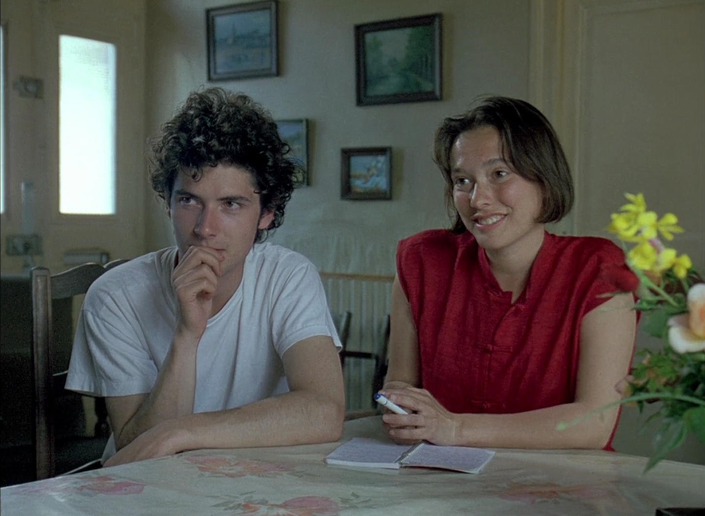
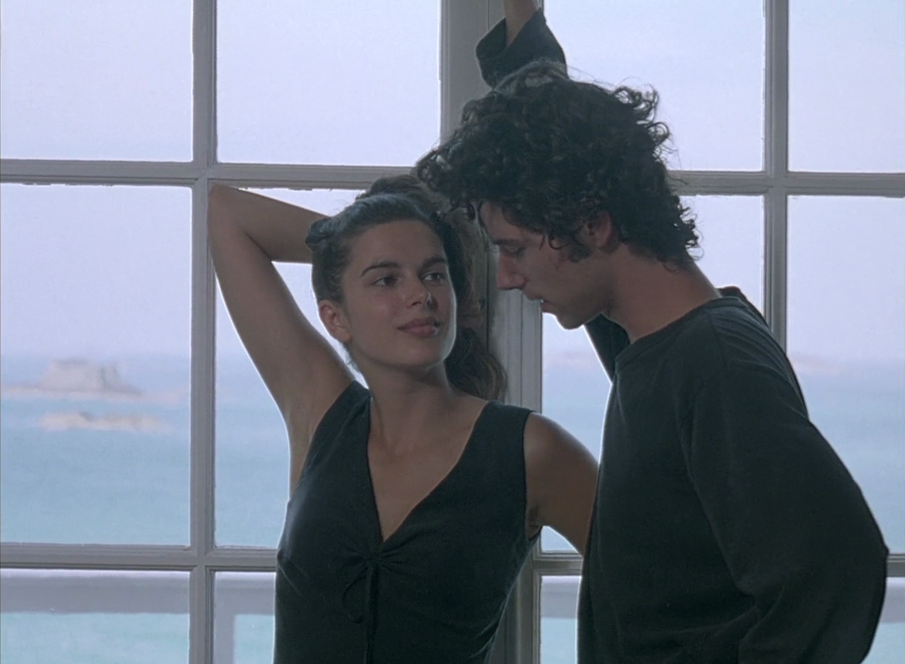
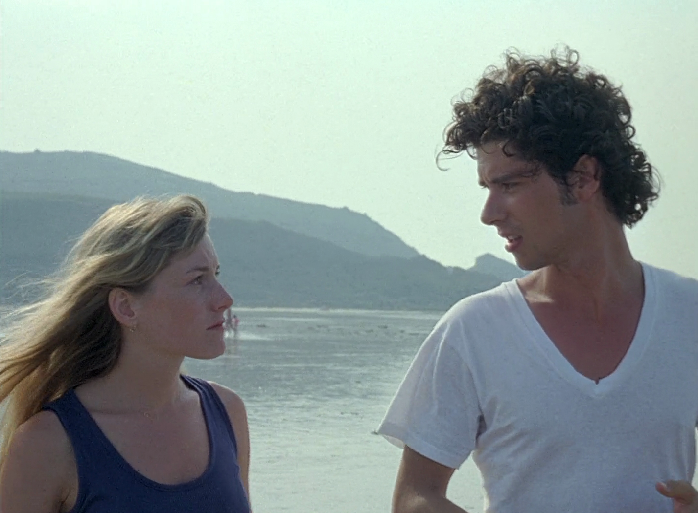
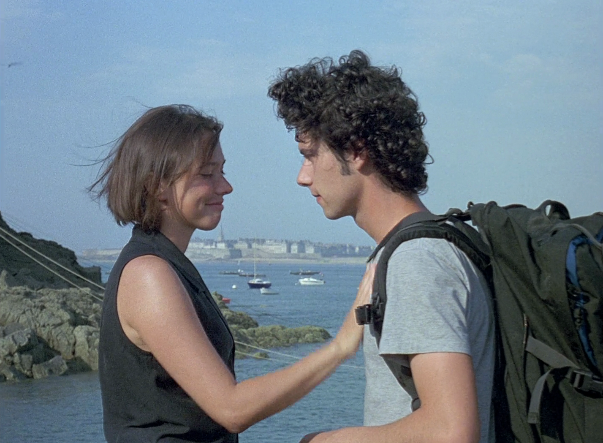
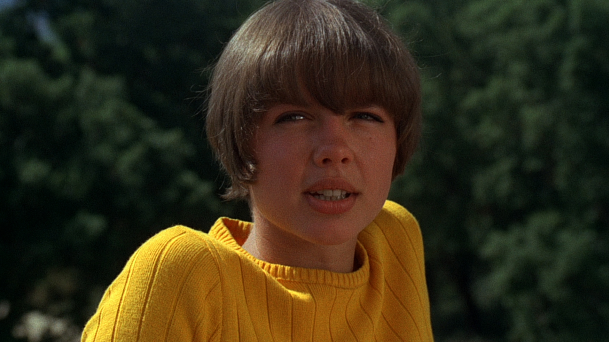
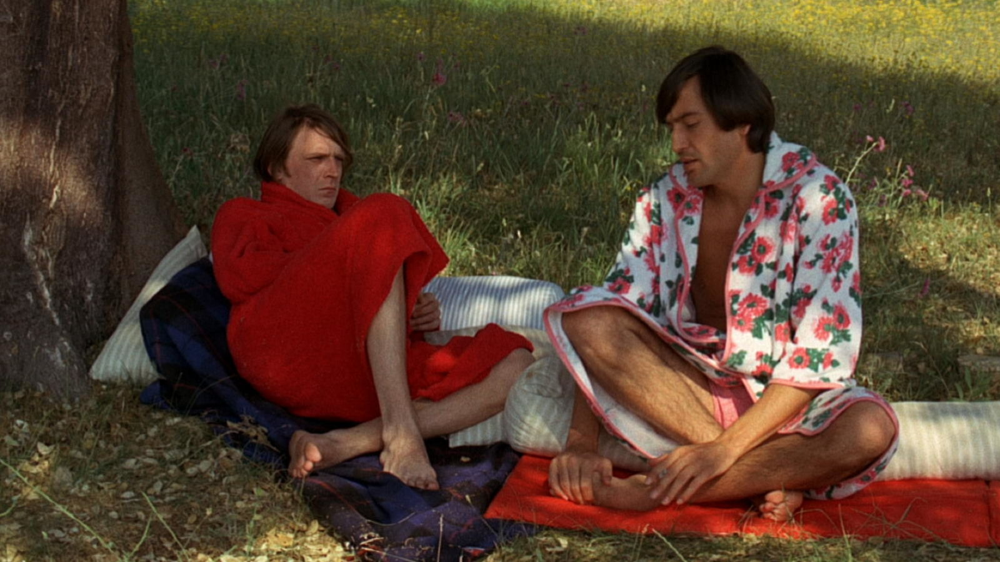
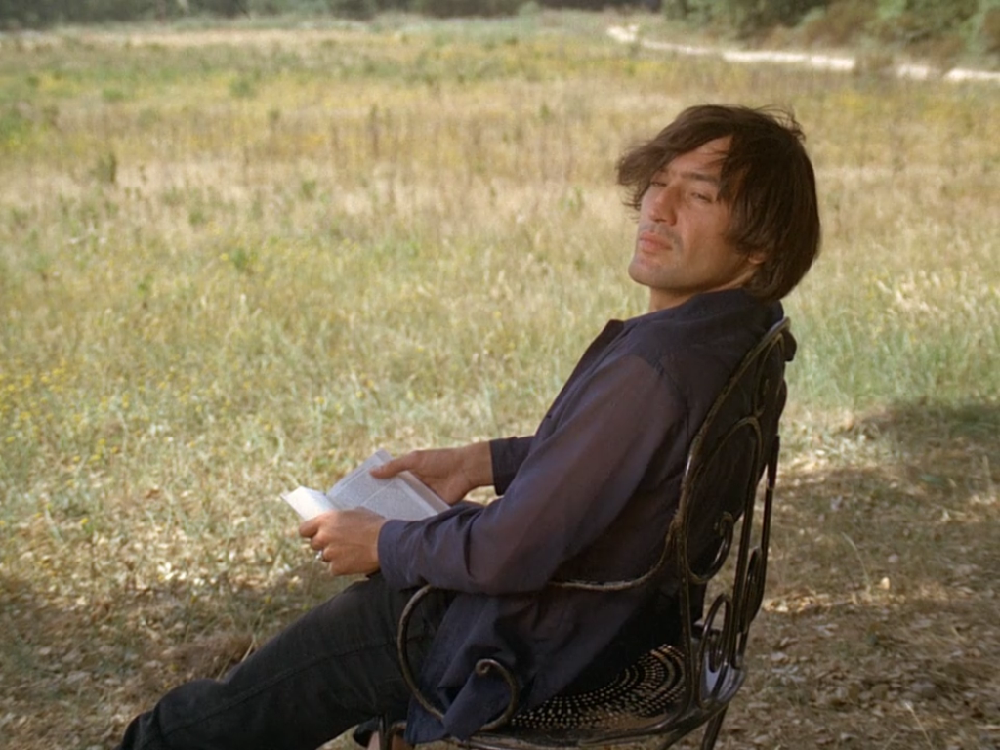
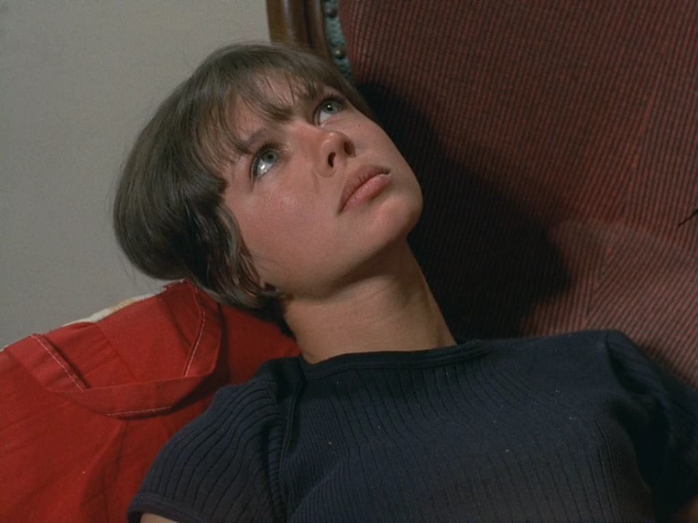
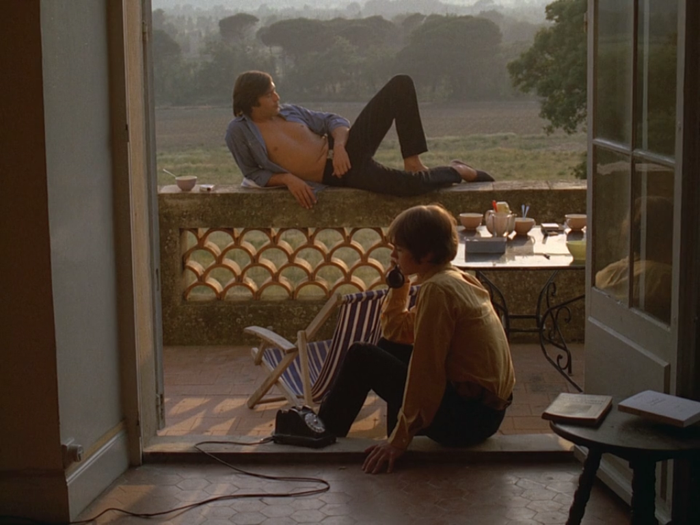

هذه قائمة محدثة تحتوي الأفلام الرومانسية التي تتناول العلاقات الإنسانية بشكل لطيف وملئ بالإرتباك وعدم الوضوح.
<!-- end -->

###(2)
فليم: **A summer's tale** 
سنة: **1996** 
إخراج: **Éric Rohmer** 
قصة: **Éric Rohmer** 

شاب وسيم في بداية العشرينات، يسافر إلى الشاطئ للإستمتاع بأجازته الصيفية منتظرًا فتاته التي لا تبادله المشاعر، لكن إنتظاره يطول فينغمس في علاقة مع فتاة أكثر جمالًا، يحاول أن يقبلها لكنها ترفض ببساطة لتأطر العلاقة كصديقين لا كحبيبين.
تصحبه معها إلى أحد النوادي الليلية، فتُعجب به حسناء تبدو لوهلة جامحة الرغبة، تصطحبه بدورها إلى منزل عمها فيغني لها الأغنية التي كتبها لصديقته الحميمة، يُقبل بعضهما الآخر لثواني إلى أن يدخل العم والعمة في لحظة ما قبل المعمعة.

###(1)
فليم: **La collectionneuse** 
سنة: **1967** 
إخراج: **Éric Rohmer** 
قصة: **Éric Rohmer** 

فتاة بوهيمية ذات رونق خاص تقتحم أجازة رجلين وتجتذبهم إلى قائمتها الطويلة من المولعين بها، تتحرك بسلاسة وإنسياب في عديد من العلاقات الغير محددة.

