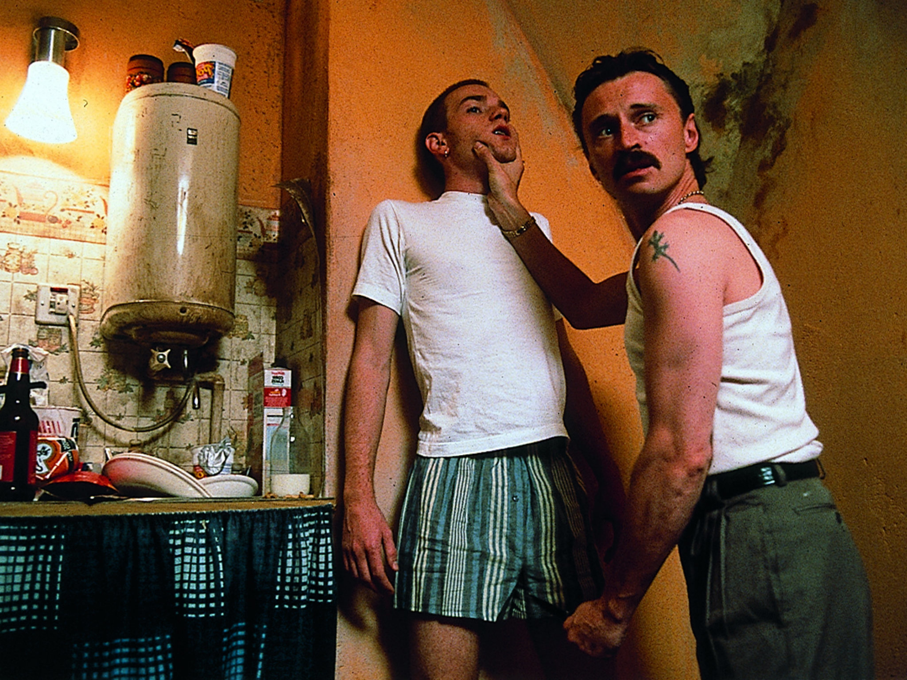
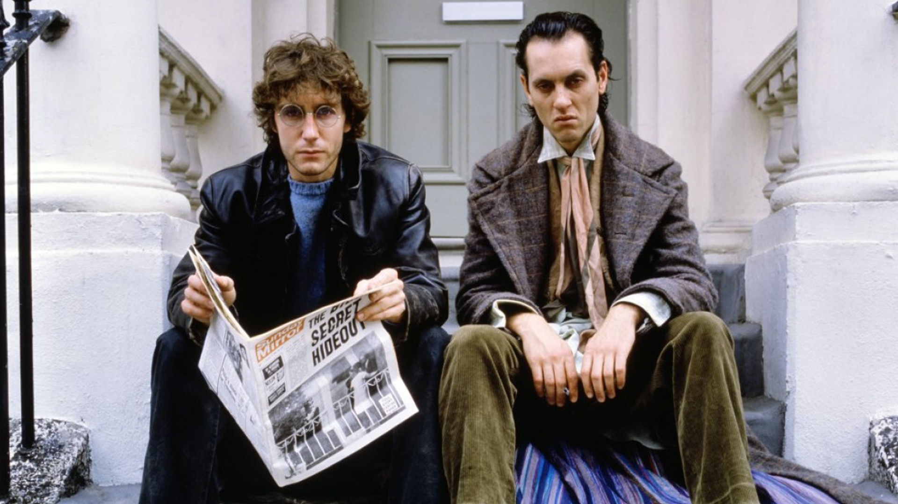

هذه قائمة محدثة تحتوي الأفلام التي أنقذتني من الإنجراف.
<!-- end -->

###(2)
فليم: **Trainspotting** 
سنة: **1996** 
إخراج: **Danny Boyle** 
قصة: **Irvine Welsh,  John Hodge** 

###(1)
فليم: **Withnail and I** 
سنة: **1987** 
إخراج: **Bruce Robinson** 
قصة: **Bruce Robinson** 

